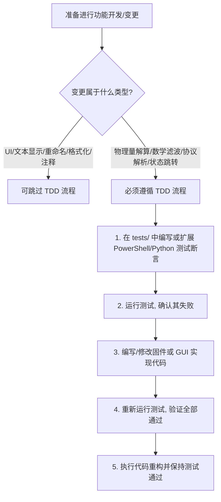

# GUIDE_developer — 嵌入式与 GUI 开发标准指南

---

## 1. 软件架构设计标准

本项目严格遵循 **三层架构分离（3-Layer Separation）** 的工业规范：
1. **数据/硬件抽象层（Data/HAL Layer）**：由 STM32 HAL 与自定义底置驱动（如 `adc_dma_driver.c`、`uart_dma_driver.c`）组成，负责直接物理读写与数据传输，严禁包含任何业务逻辑。
2. **中间件与解算层（Processor/Helper Layer）**：由 `adc_physics.c` 和 `adc_calib.c` 组成，负责数学解算、双点插值、滑动滤波与物理增益还原，绝不接触中断或通信收发器。
3. **任务编排与入口层（Orchestrator/Entry Layer）**：由 `app_freertos.c` 与 `main.c` 组成，负责 RTOS 任务创建、时间片管理与多模块调度。

---

## 2. RTOS 任务时间片与 Poll 交互规范

在 FreeRTOS 多任务并发环境下，为兼顾高频模拟信号采集（1KHz）的确定性与串口交互的吞吐率，项目采用了**极低开销的非阻塞轮询（Poll）机制**。

### 2.1 任务轮询调度标准
UART 接收驱动的解包与自愈不采用高开销的中断实时解算，而是通过在独立低优先级 RTOS 线程中以 200Hz（每 5ms）的频率进行轻量级轮询实现。以下为任务执行的核心调度机制：

```c
void StartUartTask(void *argument)
{
  extern UART_HandleTypeDef huart1;
  
  if (UartDma_Init(&g_uart1_dma, 
                   &huart huart1, 
                   g_usart1_rx_dma_buf, 
                   USART1_RX_DMA_BUF_SIZE, 
                   g_usart1_rx_main_buf, 
                   USART1_RX_MAIN_BUF_SIZE) != HAL_OK)
  {
      Error_Handler();
  }

  char task2_msg[] = "\r\n[Task 2] UART DMA NonBlocking Running!\r\n";
  for(;;)
  {
    (void)UartDma_Transmit_NonBlocking(&g_uart1_dma, (const uint8_t*)task2_msg, (uint16_t)(sizeof(task2_msg) - 1U));
    
    for (uint16_t i = 0U; i < 400U; i++)
    {
        UartDma_Poll(&g_uart1_dma, Usart1_RxParser_Callback);
        osDelay(5);
    }
  }
}
```

### 2.2 接收回调物理边界
串口接收处理程序绝不直接在中断上下文中运行复杂的字符串解析或控制分发，而是将其投递到上述 `StartUartTask` 任务时间片中。下面为接收解析回调接口规范，实现了非阻塞原路回显与物理翻转：

```c
static void Usart1_RxParser_Callback(const uint8_t *data, uint16_t len)
{
    (void)UartDma_Transmit_NonBlocking(&g_uart1_dma, data, len);
    HAL_GPIO_TogglePin(GPIOB, GPIO_PIN_0);
}
```

---

## 3. 测试驱动开发 (TDD) 决策树

为保障系统在重构与扩展时的鲁棒性，所有关于计算、解析、滤波以及状态机变动的开发必须遵循以下决策树：



---

## 4. 零损失重构协议 (Zero-Loss Refactor Protocol)

在修改或重构已有的模块代码（例如 ADC 滤波窗口或 UART 缓冲区尺寸）时，必须执行以下三步闭环以确保重构“零损失”：
1. **快照备份**：对受影响的文件进行临时保存，并记录当前的 CNDTR 和 DMA 相关寄存器配置。
2. **渐进式替换**：优先保证接口签名不发生变化（遵守 MISRA-C 规范的常指针与类型尺寸），逐步替换内部实现。
3. **回归闭环**：修改完成后，必须连续、无错地通过 `check_adc_config.ps1` 和 `check_uart_gui_protocol.ps1` 校验。

---

## 5. 命名法与数据类型强制规范

为了支持 32 位 ARM Cortex-M4 架构的最佳执行效率并防范隐式截断错误，所有新增代码必须遵守以下类型和命令标准：

- **禁止使用基本 C 数据类型**：严禁直接使用 `int`、`short`、`char`、`double`。必须全部替换为符合 `<stdint.h>` 的显式尺寸类型：
  - `uint8_t`、`uint16_t`、`uint32_t`。
  - `int8_t`、`int16_t`、`int32_t`。
  - 浮点数强制使用 `float`（单精度，带有 `f` 后缀，如 `1.0f`，利用硬件 FPU），禁止隐式转换为 `double`。
- **只读常指针保护**：函数参数中任何无需在函数内修改的缓冲指针或配置结构体，必须强制使用 `const` 关键字修饰。
- **防御性无锁设计**：高频更新的底层共享资源（如 `g_adc_dma_buffer`），严禁使用互斥量进行硬阻塞，必须通过最新的 DMA 写偏移除以通道数作为 Slot 写满的去重判定，实现数据链路的天然解耦。
