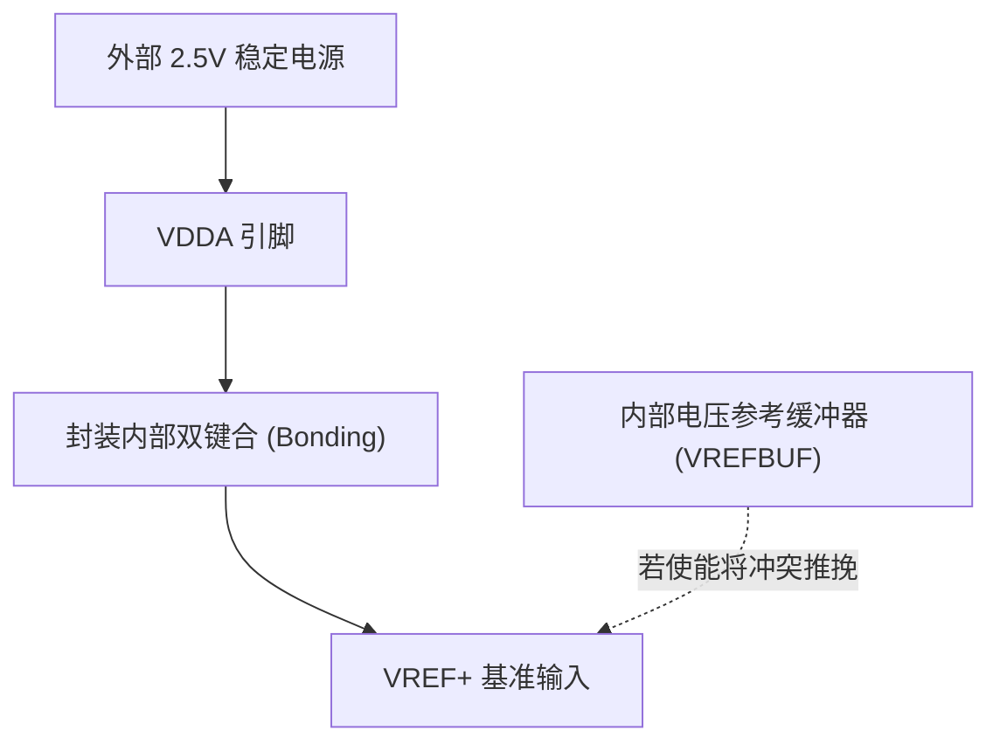

# STM32G431 平台基准源移植修改计划 (CB 到 KB)

针对项目从 **STM32G431CB (48引脚)** 移植到 **STM32G431KB (32引脚)**，且硬件参考基准变更为**外部稳定 2.5V 直供**的软硬件切换方案，特制定以下移植与修改计划。

---

## 1. 提出的具体问题

在硬件平台迁移中，我们面临以下四个具体的软硬件失配问题：

1. **VREF+ 物理冲突与烧毁风险**：在 KB (32引脚) 封装中，$V_{REF+}$ 在芯片内部直接与 $V_{DDA}$ 键合（短接）。硬件已经将外部稳定的 2.5V 接入了 $V_{DDA}$，如果固件中误使能了内部电压参考缓冲器（VREFBUF），会造成强电气冲突。
2. **常规采样序列冗余**：原系统在 [adc.c](file:///D:/zhihai/Software/FreeRTOS_PSA/Core/Src/adc.c) 中配置了第 6 通道来采集内部参考电压 `ADC_CHANNEL_VREFINT`。在 2.5V 外部硬参考源下，该采集动作冗余，浪费了 ADC 的扫描时间与 DMA 传输带宽。
3. **物理量转换公式耦合**：在 [adc_dma_driver.c](file:///D:/zhihai/Software/FreeRTOS_PSA/Core/Src/adc_dma_driver.c) 的物理通道解算中，常规通道依旧强耦合于动态解算的浮点变量 `vref_ema`，需要解耦并重构为常量换算。
4. **易被误删的硬件自校准**：部分开发人员在移除软件参考源动态补偿算法时，容易顺带误删 MCU 自带的消除模拟失调的硬件自校准函数 `HAL_ADCEx_Calibration_Start()`，这会导致常规通道精度下降。

---

## 2. 对问题的分析

### 2.1 封装与 VREFBUF 分析
STM32G431KB 封装精简，其内部基准参考源通路如图所示：

因此，必须在初始化阶段将 VREFBUF 关闭以实施阻抗隔离。

### 2.2 ADC 扫描及 DMA 映射分析
原固件中定义的常规通道数宏为 `ADC_DRV_CHANNEL_CNT = 6`。
如果将通道数裁减为 `5`，而不同步修改 DMA 驱动中的 `g_adc_dma_buffer` 大小和索引换算宏，DMA 搬运的物理槽位会出现错位，进而把常规通道的数据投递到错误的通道滑窗滤波器中。因此，必须在 [adc_dma_driver.c](file:///D:/zhihai/Software/FreeRTOS_PSA/Core/Src/adc_dma_driver.c) 中对通道索引和缓冲分配进行外科手术式对齐。

### 2.3 自校准消除机制分析
`HAL_ADCEx_Calibration_Start()` 用于计算 ADC 内部电容阵列的电荷泄露失调以及输入比较器的失调电压，它会在校准后把偏差值填入 ADC 的 `CALFACT` 寄存器中。即使 $V_{REF+}$ 恒定为外部 2.5V，此硬件偏差依然存在。必须保留该函数，并且必须在 ADC 已使能但未转换时运行。

---

## 3. 解决问题的思路与实施步骤

针对上述问题分析，解决思路主要分为外设层配置、驱动层解耦以及计算层常量重构：

### 3.1 步骤一：硬件引脚与初始化配置（修改 CubeMX 及初始化代码）
* **禁用 VREFBUF**：
  * 在 [gpio.c](file:///D:/zhihai/Software/FreeRTOS_PSA/Core/Src/gpio.c) 的初始化段，添加显式调用：
    ```c
    HAL_SYSCFG_DisableVREFBUF();
    ```
* **裁剪 ADC1 通道配置**：
  * 在 [adc.c](file:///D:/zhihai/Software/FreeRTOS_PSA/Core/Src/adc.c) 中，将常规通道扫描总数 `hadc1.Init.NbrOfConversion` 改为 `5`。
  * 注释或删除原本 Rank 6 的 `ADC_CHANNEL_VREFINT` 配置段，使常规通道只扫描至 Rank 5（即片温通道）。

### 3.2 步骤二：DMA 缓冲区重新对齐（修改 DMA 驱动层）
* 在 [adc_dma_driver.c](file:///D:/zhihai/Software/FreeRTOS_PSA/Core/Src/adc_dma_driver.c) 中：
  * 将 `ADC_DRV_CHANNEL_CNT` 从 `6` 改为 `5`，使 DMA 重置为 5 槽位分配。
  * 在 [Measure_UpdateRange()](file:///D:/zhihai/Software/FreeRTOS_PSA/Core/Src/adc_dma_driver.c#L419) 函数中，将常规物理通道更新数量降为 5：
    * 剔除原本 Rank 6 的 `filtered_val` 读取与滤波行为。
    * 废弃 [ADC_Calib_Update](file:///D:/zhihai/Software/FreeRTOS_PSA/Core/Src/adc_calib.c#L139) 动态更新引擎调用。

### 3.3 步骤三：计算与反向解算常量化（重构计算层）
* 弃用 [adc_calib.c](file:///D:/zhihai/Software/FreeRTOS_PSA/Core/Src/adc_calib.c) 中的动态推算逻辑（若为了兼容，可保留结构体形式，但将其输出直接挂载到常量 `2.5f`）。
* 在常规通道转换公式中，将传入的 `vref_ema`（或解算毫伏参数）直接修改为固定值：
  ```c
  #define PHYS_VREF_CONST_V    (2.5f)    /* 外部稳定的固定 2.5V 基准 */
  ```
  换算公式解耦重构为：
  `V_channel = (raw_code / 4095.0f) * PHYS_VREF_CONST_V;`

### 3.4 步骤四：自校准安全注入
* 校验 [adc.c](file:///D:/zhihai/Software/FreeRTOS_PSA/Core/Src/adc.c) 或相关的 ADC 开启流程，确保 `HAL_ADCEx_Calibration_Start(&hadc1, ADC_SINGLE_ENDED)` 在 `HAL_ADC_Start_DMA` 执行前被正确调度并校验其返回值。

### 3.5 步骤五：编译与本地测试回归
1. 启动项目编译，修复所有的 `unused` 警告。
2. 运行 `powershell -File tests/check_adc_config.ps1` 检验全新的 ADC 及引脚标定数据。
3. 运行 `powershell -File tests/check_uart_gui_protocol.ps1` 校验状态机业务链路完整性。
